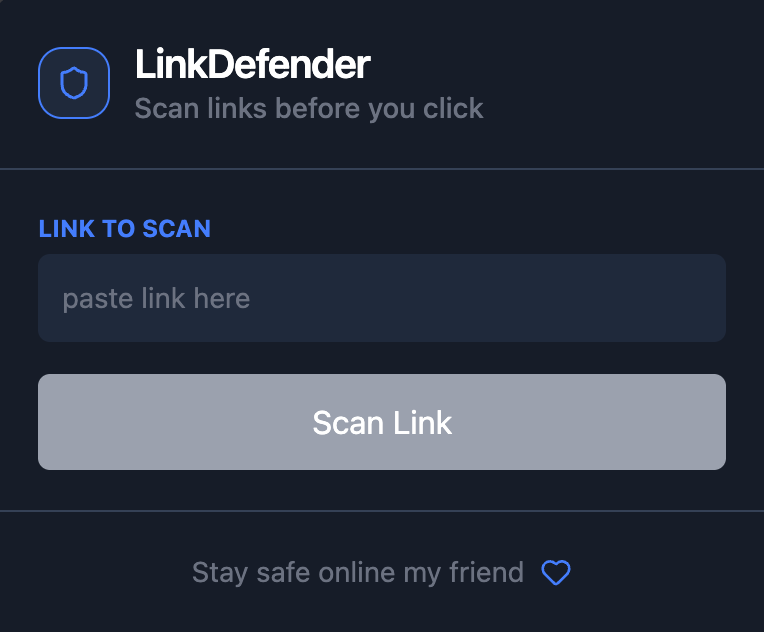
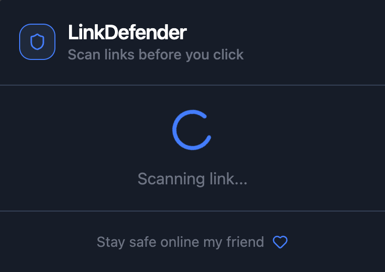
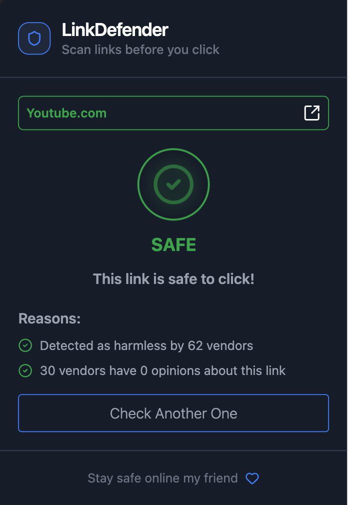
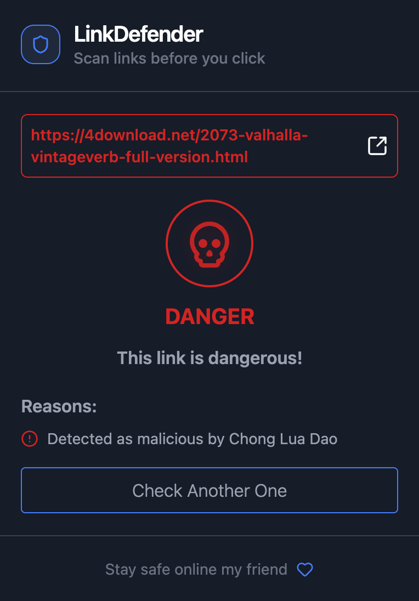
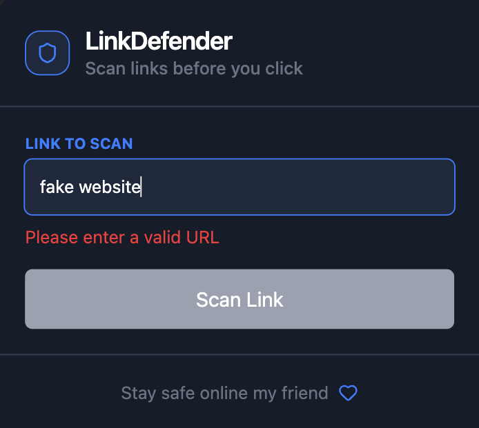
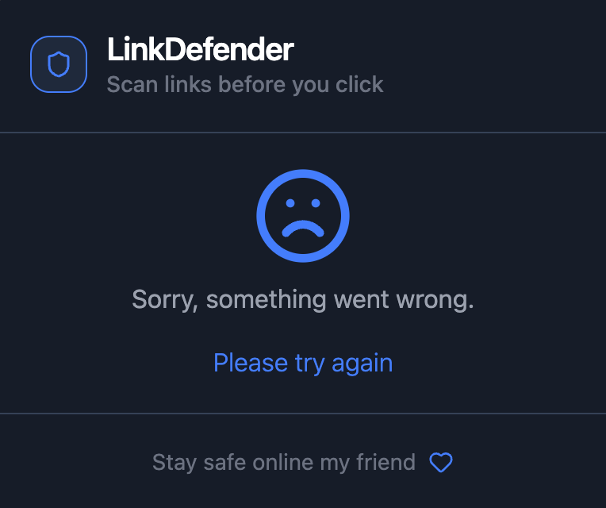

# 🛡️ LinkDefender

<p align="center">
  <strong>Know before you click.</strong><br>
  A modern Chrome extension that analyzes URLs using the VirusTotal API, helping users identify potentially malicious links before visiting them.
</p>

<p align="center">
  
</p>

---

## ✨ Overview

LinkDefender is a Chrome Extension built with **React**, **Tailwind CSS**, and **Manifest V3** that allows users to scan URLs before opening them.

Unlike traditional link checkers, LinkDefender presents security results through a clean, state-driven interface designed to make threat information easy to understand.

The extension communicates with the **VirusTotal API**, polls for asynchronous analysis, and aggregates security vendor verdicts into a simple **Safe** or **Dangerous** recommendation.

---

# 📸 Screenshots

## Idle State



The popup is ready to accept a URL. Users can paste a link and either press **Enter** or click **Scan Link**.

---

## Loading



While VirusTotal performs analysis, LinkDefender continuously polls for completion and provides visual feedback.

---

## Safe Verdict



Displays a clear security verdict along with the number of vendors that classified the URL as safe.

---

## Dangerous Verdict



Potentially malicious URLs display a warning together with detailed vendor detections and safety recommendations.

---

## Client-side Validation



Invalid URLs are detected before any API request is sent, reducing unnecessary network calls and improving user experience.

---

## Error Handling



Graceful fallback UI handles invalid responses, API failures, and timeout scenarios.

---

# 🚀 Features

- 🛡️ Scan URLs using the VirusTotal API
- ⚡ Manual URL scanning from the popup
- ⌨️ Press **Enter** to instantly start scanning
- ✅ Clear Safe / Dangerous verdicts
- 📊 Vendor-by-vendor security analysis
- 🔄 Automatic polling while analysis is in progress
- 🚫 Client-side URL validation
- 🎨 Modern dark interface built with Tailwind CSS
- ⚛️ State-driven React architecture
- 🧩 Chrome Extension built using Manifest V3

---

# 🏗 Architecture

```
             User
               │
               ▼
        React Popup (UI)
               │
               ▼
      VirusTotal API Request
               │
               ▼
      Poll Until Complete
               │
               ▼
      Parse Analysis Results
               │
               ▼
     Safe / Danger / Error UI
```

The project follows a component-driven architecture where each application state is isolated into its own React component, keeping the codebase predictable and easy to extend.

---

# 🧱 Tech Stack

| Technology                   | Purpose                        |
| ---------------------------- | ------------------------------ |
| React                        | Popup interface                |
| Tailwind CSS                 | UI styling                     |
| Vite                         | Build tooling                  |
| Chrome Extension Manifest V3 | Browser extension architecture |
| VirusTotal API               | Threat intelligence            |
| Lucide React                 | Icons                          |

---

# ⚙️ Installation

## Clone the repository

```bash
git clone https://github.com/yourusername/LinkDefender.git
```

```bash
cd LinkDefender/popup
```

---

## Install dependencies

```bash
npm install
```

---

## Configure Environment Variables

Copy the example environment file.

```bash
cp .env.example .env
```

Open `.env` and replace the placeholder value with your own VirusTotal API key.

```env
VITE_VIRUSTOTAL_API_KEY=your_api_key_here
```

> **Important**
>
> LinkDefender does **not** include a VirusTotal API key.
>
> Obtain your own free API key from VirusTotal and keep it private.
>
> Never commit your `.env` file to GitHub.

---

## Build the popup

```bash
npm run build
```

This outputs the production files used by the Chrome extension.

---

## Load the extension

1. Open `chrome://extensions`
2. Enable **Developer Mode**
3. Click **Load unpacked**
4. Select the `extension` folder

---

# 📁 Project Structure

```
LinkDefender
│
├── extension/
│   ├── manifest.json
│   ├── icons/
│   ├── background.js
│   ├── content.js
│   └── popup/
│
├── popup/
│   ├── src/
│   ├── services/
│   ├── components/
│   ├── public/
│   ├── dist/
│   ├── .env.example
│   └── ...
│
├── screenshots/
│
└── README.md
```

---

# 🧠 Engineering Highlights

Building LinkDefender introduced me to several concepts beyond traditional React applications:

- Building Chrome Extensions with Manifest V3
- Integrating third-party REST APIs
- Implementing asynchronous polling workflows
- Designing state-driven React interfaces
- Managing API credentials securely using environment variables
- Performing client-side URL validation before network requests
- Building production-ready React applications with Vite

---

# 🛣 Roadmap

## Completed

- ✅ React popup UI
- ✅ Manifest V3 integration
- ✅ VirusTotal API integration
- ✅ Asynchronous polling
- ✅ Client-side validation
- ✅ Safe & Dangerous verdicts
- ✅ Error handling
- ✅ Keyboard shortcut (Enter to scan)

## Planned

- ⏳ Scan links directly from webpages
- ⏳ Hover-to-scan functionality
- ⏳ Short URL expansion
- ⏳ Scan history
- ⏳ Framer Motion animations

---

# ⚠️ Disclaimer

LinkDefender uses VirusTotal as a threat intelligence source.

A "Safe" verdict should not be interpreted as an absolute guarantee that a URL is harmless. Always exercise caution when visiting unfamiliar websites.

---

# 📄 License

MIT License

---

<p align="center">
Built with ❤️ by <strong>Abhijit Ghosh</strong>
</p>
